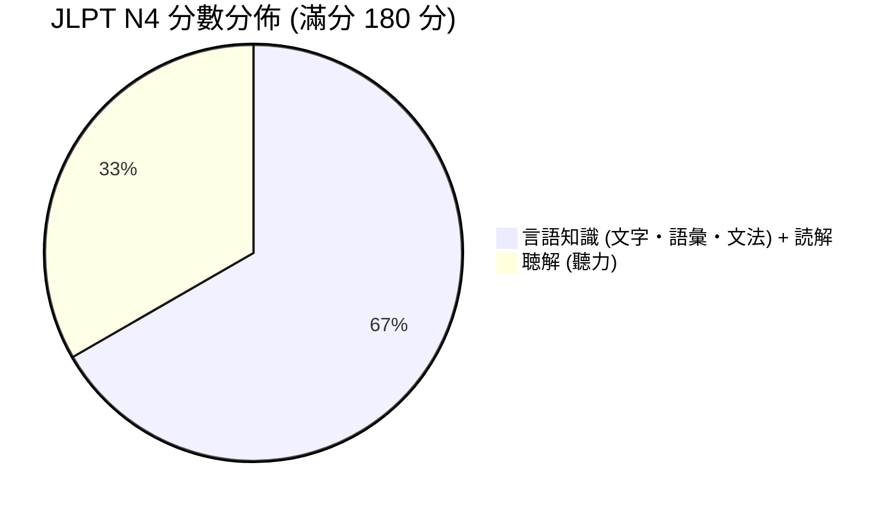
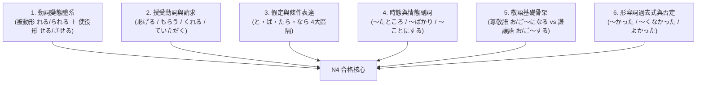

# 📚 日本語能力試験 (JLPT) N4 歷屆試題庫與備考全景總覽 (Past Exams Master Index)

> **戰略定位**：  
> 本目錄為 [japanese/japanese/past_exams/](file:///Users/shanwu/life_path/japanese/japanese/past_exams/) 之專屬置頂導航看板。  
> 彙整了 **過去 5 年（2020 年～2024 年）歷屆真題詳解、官方完整試題手冊（Official Practice Workbooks Vol. 1 & Vol. 2 全部 14 份無損 PDF）**、完整聽解對白文字稿與高頻考點分析。  
> 
> * **整理歸檔**：Lia（宋莉亞）🌹 × 山霧（宋哲光）  
> * **目標考區**：高雄考區（JLPT N4 高分通關）  
> * **最後更新**：2026 年 09 月 17 日

---

## 📊 N4 考制架構、分值與及格標準 (Scoring & Test Structure)

JLPT N4 滿分為 **180 分**，合格判定採「總分合格線」與「各科目單項門檻線（得點區分基準點）」雙軌制：

### 1. 及格門檻與合格標準表

| 得點科目區分 | 測驗內容 | 得點範圍 | 基準點 (單項最低門檻) | 合格判定條件 |
| :--- | :--- | :---: | :---: | :--- |
| **言語知識・読解** | 文字・語彙（25分鐘） 文法・読解（55分鐘） | 0 ～ 120 分 | **38 分** | ① 總得分 $\ge$ **90 分** ② 言語知識・読解 $\ge$ **38 分** ③ 聴解 $\ge$ **19 分** *(兩科目皆不可低於基準點)* |
| **聴解** | 課題理解 / 要點理解 / 發話表現 / 即時應答（35分鐘） | 0 ～ 60 分 | **19 分** |
| **合計 (Total)** | **全科目總體檢定** | **0 ～ 180 分** | **總分門檻 90 分** |

---

## 🏛️ 第一部分：官方權威試題集 (Official Practice Workbooks)

日本國際教育支援協會（JEES）與國際交流基金（The Japan Foundation）官方發布之標準真題選輯，格式與難度最貼合實體大考。本地已完成 14 份無損 PDF 完整歸檔：

### 1. 《日本語能力試験 公式問題集 第二集》(Vol. 2 - 2018 年版)
- 📁 **本地存放目錄**：[`official_workbook_vol2_2018/`](file:///Users/shanwu/life_path/japanese/japanese/past_exams/official_workbook_vol2_2018/)
- 📄 [文字・語彙試卷 (N4V.pdf)](file:///Users/shanwu/life_path/japanese/japanese/past_exams/official_workbook_vol2_2018/N4V.pdf) — 漢字讀音、假名轉漢字、脈絡規定、替換近義詞
- 📄 [文法試卷 (N4G.pdf)](file:///Users/shanwu/life_path/japanese/japanese/past_exams/official_workbook_vol2_2018/N4G.pdf) — 語法形式判斷、句子組織（排序星號題）、文章文法
- 📄 [讀解試卷 (N4R.pdf)](file:///Users/shanwu/life_path/japanese/japanese/past_exams/official_workbook_vol2_2018/N4R.pdf) — 內容理解（短篇、中篇）、資訊檢索
- 📄 [聽解試卷 (N4L.pdf)](file:///Users/shanwu/life_path/japanese/japanese/past_exams/official_workbook_vol2_2018/N4L.pdf) — 課題理解、要點理解、言語表達、即時應答
- 📄 [官方正解一覽表 (N4answer.pdf)](file:///Users/shanwu/life_path/japanese/japanese/past_exams/official_workbook_vol2_2018/N4answer.pdf) — 全卷標準答案
- 📄 [聽解對白完整腳本 (N4script.pdf)](file:///Users/shanwu/life_path/japanese/japanese/past_exams/official_workbook_vol2_2018/N4script.pdf) — 錄音廣播與角色對話日語原文
- 📄 [標準答案卡樣張 (N4sheet.pdf)](file:///Users/shanwu/life_path/japanese/japanese/past_exams/official_workbook_vol2_2018/N4sheet.pdf) — 實戰劃卡模擬樣張

### 2. 《日本語能力試験 公式問題集 第一集》(Vol. 1 - 2012 年版)
- 📁 **本地存放目錄**：[`official_workbook_vol1_2012/`](file:///Users/shanwu/life_path/japanese/japanese/past_exams/official_workbook_vol1_2012/)
- 📄 [文字・語彙試卷 (N4V.pdf)](file:///Users/shanwu/life_path/japanese/japanese/past_exams/official_workbook_vol1_2012/N4V.pdf)
- 📄 [文法試卷 (N4G.pdf)](file:///Users/shanwu/life_path/japanese/japanese/past_exams/official_workbook_vol1_2012/N4G.pdf)
- 📄 [讀解試卷 (N4R.pdf)](file:///Users/shanwu/life_path/japanese/japanese/past_exams/official_workbook_vol1_2012/N4R.pdf)
- 📄 [聽解試卷 (N4L.pdf)](file:///Users/shanwu/life_path/japanese/japanese/past_exams/official_workbook_vol1_2012/N4L.pdf)
- 📄 [官方正解一覽表 (N4answer.pdf)](file:///Users/shanwu/life_path/japanese/japanese/past_exams/official_workbook_vol1_2012/N4answer.pdf)
- 📄 [聽解對白完整腳本 (N4script.pdf)](file:///Users/shanwu/life_path/japanese/japanese/past_exams/official_workbook_vol1_2012/N4script.pdf)
- 📄 [標準答案卡樣張 (N4sheet.pdf)](file:///Users/shanwu/life_path/japanese/japanese/past_exams/official_workbook_vol1_2012/N4sheet.pdf)

---

## 📝 第二部分：近 5 年 (2020～2024) 歷屆實戰真題詳解專區

收錄過去 5 年共 9 次實體大考之文字語彙真題、文法題型、參考答案與聽力錄音文字稿：

| 考試回別 | 真題詳解文檔 (點擊直接跳轉) | 試題特點與核心考點 |
| :--- | :--- | :--- |
| **2024 年 12 月** | [2024_12_jlpt_n4_exam.md](./2024_12_jlpt_n4_exam.md) | 工事・入院・親指、自動詞/他動詞（われる・こしょう）、～によると、使役形（よろこばせた）、聽解原文全收錄 |
| **2024 年 07 月** | [2024_07_jlpt_n4_exam.md](./2024_07_jlpt_n4_exam.md) | 待って・予報・動かなく、被動形（しかられた）、～そうです（傳聞）、複合助詞、聽解原文全收錄 |
| **2023 年 12 月** | [2023_12_jlpt_n4_exam.md](./2023_12_jlpt_n4_exam.md) | 歌・利用・会場・決まりましたか、授受動詞（くれる/もらう）、時間幅表達、聽解原文全收錄 |
| **2023 年 07 月** | [2023_07_jlpt_n4_exam.md](./2023_07_jlpt_n4_exam.md) | 白い・最近・都合・着きました、～ことにしました（決定）、比較級（～より早く）、聽解原文全收錄 |
| **2022 年 12 月** | [2022_12_jlpt_n4_exam.md](./2022_12_jlpt_n4_exam.md) | 運ぶ・始まる・注意、授受關係、理由助詞、聽解原文全收錄 |
| **2022 年 07 月** | [2022_07_jlpt_n4_exam.md](./2022_07_jlpt_n4_exam.md) | 工事・進んで・数えて・営業、状態副詞（どんどん、はっきり）、假定形（～ば） |
| **2021 年 12 月** | [2021_12_jlpt_n4_exam.md](./2021_12_jlpt_n4_exam.md) | 出発・最後・調べる、～たり～たりする、並列助詞、聽解原文全收錄 |
| **2021 年 07 月** | [2021_07_jlpt_n4_exam.md](./2021_07_jlpt_n4_exam.md) | 案内・急いで・集まる、義務句型（～なければならない）、許可/禁止表現 |
| **2020 年 12 月** | [2020_12_jlpt_n4_exam.md](./2020_12_jlpt_n4_exam.md) | 題量微調後首回新制檢定、生活情境對話實戰、聽解完整對白全收錄 |

---

## 🎯 第三部分：近 5 年 N4 真題高頻失分點與必考文法矩陣

依據 2020～2024 年真題出現頻率精算，以下六大語法板塊佔據文法大題 70% 分值：

1. **被動與使役被動（受身・使役受身）**：
   - 考點：母にしかられました（被媽媽罵）、友達を待たせている（讓朋友等待）、田中さんは彼女をよろこばせた（田中讓女友開心）。
2. **授受動詞（やりもらい）**：
   - 考點：トマトを切ってもらえる？（能幫我切番茄嗎？）、花をプレゼントしてくれた（為我送了花）。
3. **假定條件四天王**：
   - `と`（自然恆常結果）
   - `ば`（假定假設）
   - `たら`（完成後接續／口語最常用）
   - `なら`（接對方話題給予建議）
4. **傳聞 vs 推量 vs 樣態**：
   - `～そうだ`（聽說 / 看起來快要...）
   - `～によると`（根據...所說，必搭配傳聞そうだ）
5. **形容詞時態與否定（本課 Unit 3 核心）**：
   - 促音停頓：`高かった` (takakatta)
   - 否定過去：`高くなかった` (takakunakatta)
   - 特殊不規則：`いい ➔ よかった / よくなかった`（大考每年必出）

---

## 🚀 Lia 參謀軍事級刷題戰略路徑 (Action Plan)

1. **第一階段：基礎體系鞏固（當前）**
   - 每日精讀 [japanese/japanese/](file:///Users/shanwu/life_path/japanese/japanese/) 課文，產出重點 Anki 卡片並複習。
2. **第二階段：官方標準卷模考（考前 60 天）**
   - 嚴格計時執行 [official_workbook_vol2_2018/](file:///Users/shanwu/life_path/japanese/japanese/past_exams/official_workbook_vol2_2018/)，檢驗文字語彙與文法閱讀手感。
3. **第三階段：近 5 年真題地毯式排查（考前 30 天）**
   - 逐卷精讀 2020～2024 年 9 回真題，將生詞與錯題無死角收錄至個人 Anki 題庫。
