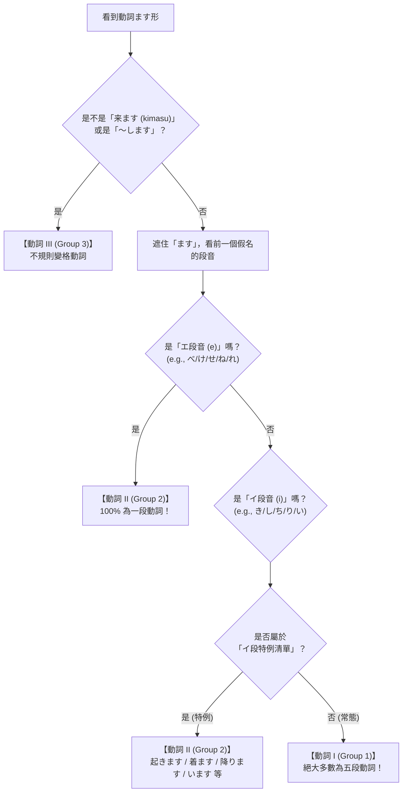

# 3 活用練習 - 動詞のグループ分け (Verb Groups)

* **教材單元**：Unit 3 きのうの買い物 (2) - 活用練習 (Verb Conjugation)
* **課本頁碼**：Page 43
* **對應進度**：TRY! 日本語 N5 達陣第 8 ～ 14 項文法活用基礎
* **核心主題**：日語動詞三大類群分類法（動詞のグループ分け / Group 1・Group 2・Group 3）

---

## 🎯 學習目標 (Learning Objectives)

> 💡 **核心能力指標（できること / Can-Do）**：
> 1. **一眼辨識動詞類別**：能根據動詞「ます形」的音節與形態特徵，準確判斷其屬於「動詞 I（五段）」、「動詞 II（一段）」還是「動詞 III（不規則變格）」。
> 2. **精準避開特例陷阱**：熟練掌握常見且致命的「イ段音 Group II 特例動詞」（如：起きます、着ます、降ります、借ります、います 等）。
> 3. **奠定活用基石**：為後續「て形（連用接續）」、「た形（過去簡體）」、「ない形（否定）」與「辭書形（原形）」的活用規則建立不可動搖的底層邏輯。

---

## 📚 一、 生字表與核心動詞彙整 (Vocabulary List)

> 📌 **初學者指引**：日語初學階段通常優先學習**「ます形（敬體禮貌形）」**。要掌握動詞分類，請仔細觀察**「ます」前方的最後一個假名**落在哪個「段音」（イ段還是エ段）。

### 1. 動詞 I（Group 1 / 五段動詞 / ます前為「イ段音」）

| 漢字 / 詞彙 | 平假名 | 羅馬拼音 (Rōmaji) | 辭書形 (原形) | ます前假名與段音 | 中文釋義 | 實用記憶技巧與常見搭配 |
| :--- | :--- | :--- | :--- | :--- | :--- | :--- |
| **書きます** | かきます | kakimasu | 書く (kaku) | **き** (か行イ段) | 寫、書寫 | 手紙を**書きます**（寫信）。 |
| **脱ぎます** | ぬぎます | nugimasu | 脱ぐ (nugu) | **ぎ** (が行イ段) | 脫掉（衣鞋帽子） | 靴を**脱ぎます**（脫鞋）。 |
| **話します** | はなします | hanashimasu | 話す (hanasu) | **し** (さ行イ段) | 說話、談話 | 日本語で**話します**（用日文交談）。 |
| **立ちます** | たちます | tachimasu | 立つ (tatsu) | **ち** (た行イ段) | 站立、站起來 | 席を**立ちます**（離席、站起來）。 |
| **死にます** | しにます | shinimasu | 死ぬ (shinu) | **に** (な行イ段) | 死亡、死去 | 日語中唯一な行五段動詞。 |
| **遊びます** | あそびます | asobimasu | 遊ぶ (asobu) | **び** (ば行イ段) | 玩耍、遊玩 | 公園で**遊びます**（在公園玩）。 |
| **読みます** | よみます | yomimasu | 読む (yomu) | **み** (ま行イ段) | 閱讀、讀 | 本を**読みます**（讀書）。 |
| **帰ります** | かえります | kaerimasu | 帰る (kaeru) | **り** (ら行イ段) | 回去、回家 | うちへ**帰ります**（回家）。 |
| **言います** | いいます | iimasu | 言う (iu) | **い** (あ行イ段) | 說、講 | ありがとうと**言います**（說謝謝）。 |
| **引きます** | ひきます | hikimasu | 引く (hiku) | **き** (か行イ段) | 拉、彈(樂器)、查(辭典) | ピアノを**引きます** / 辞書を**引きます**。 |
| **取ります** | とります | torimasu | 取る (toru) | **り** (ら行イ段) | 拿取、拍照(撮る) | 写真を**取ります**（拍照）。 |
| **あります** | あります | arimasu | ある (aru) | **り** (ら行イ段) | 有、在 (無生物) | 本が**あります**（有書）。 |
| **使います** | つかいます | tsukaimasu | 使う (tsukau) | **い** (あ行イ段) | 使用、利用 | パソコンを**使います**（用電腦）。 |
| **乗ります** | のります | norimasu | 乗る (noru) | **り** (ら行イ段) | 搭乘、乘坐 | 電車に**乗ります**（搭電車）。 |

---

### 2. 動詞 II（Group 2 / 一段動詞）

#### 🔹 規律型：ます前為「エ段音」（佔 90% 以上 / 下一段動詞）

| 漢字 / 詞彙 | 平假名 | 羅馬拼音 (Rōmaji) | 辭書形 (原形) | ます前假名與段音 | 中文釋義 | 實用記憶技巧與常見搭配 |
| :--- | :--- | :--- | :--- | :--- | :--- | :--- |
| **掛けます** | かけます | kakemasu | 掛ける (kakeru) | **け** (か行エ段) | 打(電話)、掛上 | 電話を**かけます**（打電話）。 |
| **見せます** | みせます | misemasu | 見せる (miseru) | **せ** (さ行エ段) | 給...看、展示 | パスポートを**見せます**（出示護照）。 |
| **出ます** | でます | demasu | 出る (deru) | **で** (だ行エ段) | 出去、離開、出席 | 部屋を**でます**（出房間）。 |
| **寝ます** | ねます | nemasu | 寝る (neru) | **ね** (な行エ段) | 睡覺、就寢 | 11時に**ねます**（11點睡覺）。 |
| **食べます** | たべます | tabemasu | 食べる (taberu) | **べ** (ば行エ段) | 吃、食用 | ご飯を**たべます**（吃飯）。 |
| **入れます** | いれます | iremasu | 入れる (ireru) | **れ** (ら行エ段) | 放入、裝進 | かばんに**いれます**（放進包包）。 |
| **忘れます** | わすれます | wasuremasu | 忘れる (wasureru) | **れ** (ら行エ段) | 忘記、遺忘 | 傘を**わすれます**（忘了雨傘）。 |
| **答えます** | こたえます | kotaemasu | 答える (kotaeru) | **え** (あ行エ段) | 回答、答覆 | 質問に**こたえます**（回答問題）。 |

#### ⚠️ 必背特例型：ます前為「イ段音」但屬於 Group 2（上一段動詞）

| 漢字 / 詞彙 | 平假名 | 羅馬拼音 (Rōmaji) | 辭書形 (原形) | ます前假名與段音 | 中文釋義 | 易錯警示與必背口訣 |
| :--- | :--- | :--- | :--- | :--- | :--- | :--- |
| **居ます** | います | imasu | いる (iru) | **い** (あ行イ段) | 在、有 (人或動物) | ⚠️ 雖然是「い」，但為 Group 2！ |
| **出来ます** | できます | dekimasu | できる (dekiru) | **き** (か行イ段) | 能夠、會、完成 | ⚠️ 日本語ができます（會日語）。 |
| **着ます** | きます | kimasu | 着る (kiru) | **き** (か行イ段) | 穿（上半身衣物） | ⚠️ 與「来ます(來)」同音，但此為 Group 2！ |
| **浴びます** | あびます | abimasu | 浴びる (abiru) | **び** (ば行イ段) | 淋浴、沖(澡) | シャワーを**あびます**（沖澡）。 |
| **降ります** | おります | orimasu | 降りる (oriru) | **り** (ら行イ段) | 下車、降下 | ⚠️ 電車を**おります**（下電車，與乗る對比）。 |
| **借ります** | かります | karimasu | 借りる (kariru) | **り** (ら行イ段) | 借入、向人借 | 本を**かります**（借書）。 |
| **起きます** | おきます | okimasu | 起きる (okiru) | **き** (か行イ段) | 起床、起來 | 7時に**おきます**（7點起床）。 |

---

### 3. 動詞 III（Group 3 / 不規則變格動詞）

| 漢字 / 詞彙 | 平假名 | 羅馬拼音 (Rōmaji) | 辭書形 (原形) | 類型 | 中文釋義 | 說明與搭配 |
| :--- | :--- | :--- | :--- | :--- | :--- | :--- |
| **来ます** | きます | kimasu | 来る (kuru) | カ行變格動詞 | 來、前來 | 全日語僅此一個！學校へ**きます**（來學校）。 |
| **します** | します | shimasu | する (suru) | サ行變格動詞 | 做、幹、從事 | 宿題を**します**（做作業）。 |
| **勉強します** | べんきょうします | benkyō shimasu | 勉強する | 名詞＋します | 學習、念書 | 日本語を**勉強します**（學日文）。 |
| **散歩します** | さんぽします | sanpo shimasu | 散歩する | 名詞＋します | 散步 | 公園を**散歩します**（在公園散步）。 |
| **練習します** | れんしゅうします | renshū shimasu | 練習する | 名詞＋します | 練習 | 会話を**練習します**（練習對話）。 |
| **洗濯します** | せんたくします | sentaku shimasu | 洗濯する | 名詞＋します | 洗滌、洗衣服 | 服を**洗濯します**（洗衣服）。 |
| **結婚します** | けっこんします | kekkon shimasu | 結婚する | 名詞＋します | 結婚 | 彼女と**結婚します**（和她結婚）。 |

---

## 🧠 二、 動詞三大群組分類文法全攻略 (Verb Groups Grammar Deep Dive)

### 1. 為什麼日語動詞必須分群？（文法基石論）

日語動詞在表達不同語氣、時態、連接與敬意時，字尾會產生劇烈變化（稱為**活用 / Conjugation**）。
例如：
* 想要連接兩個動作時，需要變成 **「て形」**（例：*行って、食べて、して*）；
* 想要表達過去時，需要變成 **「た形」**（例：*行った、食べた、した*）；
* 想要表達否定時，需要變成 **「ない形」**（例：*行かない、食べない、しない*）。

**每種類群的動詞，變化規則截然不同！**
如果一開始分錯類別（例如將 Group 2 的「起きます」誤認為 Group 1），後續所有的變化就會全部跟著出錯。因此，**學會 100% 精準將動詞分類，是征服日語動詞變化的第一道關鍵大門！**

---

### 2. 五十音「段」的概念複習（音段導航圖）

課本右上角附上的五十音圖，是判斷動詞群組的核心羅盤：

```text
       【ア段】  【イ段】  【ウ段】  【エ段】  【オ段】
あ行：   あ        い        う        え        お
か行：   か        き        く        け        こ
さ行：   さ        し        す        せ        そ
た行：   た        ち        つ        て        と
な行：   な        に        ぬ        ね        の
は行：   は        ひ        ふ        へ        ほ
ま行：   ま        み        む        め        も
ら行：   ら        り        る        れ        ろ
わ行：   わ        い        う        え        を
                   ⬆                   ⬆
            【動詞 I (Group 1)】 【動詞 II (Group 2)】
               絕大多數落在此        規則型落在此
```

---

### 3. 從「ます形」判斷動詞類別的黃金三步法

當你看到一個動詞的「ます形」（如 `たべます`、`かきます`、`べんきょうします`）時，請依照下列步驟進行判斷：



#### 步驟一：先抓「動詞 III」（數量最少，秒殺類）
* 只有兩大核心：**`来ます (kimasu / 來)`** 與 **`します (shimasu / 做)`**。
* 以及任何 **「動作名詞 ＋ します」**（如：*勉強します、散歩します、練習します、洗濯します、結婚します*）。

#### 步驟二：看「ます」前一個字是不是「エ段音」
* 只要ます前面的假名發音母音為 **`-e`（え・け・せ・て・ね・へ・め・れ・べ・げ・ぜ・で）**：
* 👉 **100% 絕對是「動詞 II」！毫無任何例外！**
  * 例：た**べ**ます (ta-be-masu) ➡️ べ 是エ段 ➡️ **動詞 II**
  * 例：み**せ**ます (mi-se-masu) ➡️ せ 是エ段 ➡️ **動詞 II**
  * 例：**ね**ます (ne-masu) ➡️ ね 是エ段 ➡️ **動詞 II**

#### 步驟三：若「ます」前一個字是「イ段音」，做二選一檢驗
* 絕大多數（約 90% 以上）為 **「動詞 I」**（如：*か**き**ます、はな**し**ます、よ**み**ます、の**り**ます*）。
* 但有少數關鍵動詞屬於 **「動詞 II 的上一段特例」**，必須牢牢記住！

---

### 4. 必背！「イ段音 Group II 特例動詞」記憶口訣

初學者在考試中最常失分的地方，就是把看起來像 Group 1 的動詞 II 特例搞混。
請將以下 **N5 最常考的 7 大特例動詞** 記住：

> 🌟 **生活作息記憶口訣**：  
> **早上【起床 (起きます)】，【穿衣服 (着ます)】，出門【有/在 (います)】，**  
> **坐車【下車 (降ります)】，上課【借筆記 (借ります)】，回家【沖澡 (浴びます)】，什麼都【會做 (できます)】！**

| 動詞 (ます形) | 漢字 | 原形 (辭書形) | 容易誤判原因 | 正確歸類 |
| :--- | :--- | :--- | :--- | :--- |
| **おきます** | 起きます | 起きる (okiru) | ます前為「き」(イ段) | **動詞 II** |
| **きます** | 着ます | 着る (kiru) | ます前為「き」(イ段) | **動詞 II** |
| **おります** | 降ります | 降りる (oriru) | ます前為「り」(イ段) | **動詞 II** |
| **かります** | 借ります | 借りる (kariru) | ます前為「り」(イ段) | **動詞 II** |
| **あびます** | 浴びます | 浴びる (abiru) | ます前為「び」(イ段) | **動詞 II** |
| **います** | 居ます | いる (iru) | ます前為「い」(イ段) | **動詞 II** |
| **できます** | 出来ます | できる (dekiru) | ます前為「き」(イ段) | **動詞 II** |

---

## 💬 三、 核心分類實用生活例句教學 (Practical Example Sentences)

> 💡 每一組例句均嚴格提供：**日文原句（含漢字假名）、羅馬拼音、繁體中文翻譯，以及完整單字語素清單**。

### 🔹 動詞 I（Group 1）生活例句

#### 例句 1：閱讀與寫信
> **日本語：図書館（としょかん）で 本（ほん）を 読（よ）みます。そして、友達（ともだち）に 手紙（てがみ）を 書（か）きます。**  
> **Romaji：** Toshokan de hon o yomimasu. Soshite, tomodachi ni tegami o kakimasu.  
> 📢 **中文翻譯：** 在圖書館讀書。然後，寫信給朋友。

* **本句單字拆解列表**：
  * `図書館 (としょかん / toshokan)`：名詞，圖書館。
  * `で (de)`：助詞，表示動作進行的場所。
  * `本 (ほん / hon)`：名詞，書籍、書本。
  * `を (o)`：助詞，標示動作直接受詞。
  * `読みます (よみます / yomimasu)`：動詞 I（ま行イ段 + ます），閱讀。
  * `そして (soshite)`：連接詞，然後、接著。
  * `友達 (ともだち / tomodachi)`：名詞，朋友。
  * `に (ni)`：助詞，表示動作指向的對象（給朋友）。
  * `手紙 (てがみ / tegami)`：名詞，信件。
  * `書きます (かきます / kakimasu)`：動詞 I（か行イ段 + ます），書寫。

---

#### 例句 2：搭乘交通工具回家
> **日本語：毎晩（まいばん）、駅（えき）で 電車（でんしゃ）に 乗（の）って、うちへ 帰（かえ）ります。**  
> **Romaji：** Maiban, eki de densha ni notte, uchi e kaerimasu.  
> 📢 **中文翻譯：** 每天晚上在車站搭電車，然後回家。

* **本句單字拆解列表**：
  * `毎晩 (まいばん / maiban)`：名詞/副詞，每天晚上。
  * `駅 (えき / eki)`：名詞，車站。
  * `電車 (でんしゃ / densha)`：名詞，電車。
  * `に (ni)`：助詞，搭乘的接觸著落點。
  * `乗って (のって / notte)`：動詞 I「乗ります」的て形，搭乘。
  * `うち (uchi)`：名詞，家、住所。
  * `へ (e)`：助詞，標示移動的方向目標。
  * `帰ります (かえります / kaerimasu)`：動詞 I（ら行イ段 + ます），回去、回家。

---

### 🔹 動詞 II（Group 2）生活例句

#### 例句 3：吃飯與睡覺（規律エ段型）
> **日本語：夜（よる）７時（しちじ）に 晩（ばん）ご飯（はん）を 食（た）べます。１１時（じゅういちじ）に 寝（ね）ます。**  
> **Romaji：** Yoru shichiji ni bangohan o tabemasu. Jūichiji ni nemasu.  
> 📢 **中文翻譯：** 晚上七點吃晚餐。十一點睡覺。

* **本句單字拆解列表**：
  * `夜 (よる / yoru)`：名詞，夜晚、晚上。
  * `７時 (しちじ / shichiji)`：時間名詞，七點。
  * `に (ni)`：助詞，標示具體的時間點。
  * `晩ご飯 (ばんごはん / bangohan)`：名詞，晚餐。
  * `を食べます (たべます / tabemasu)`：動詞 II（ば行エ段 + ます），吃。
  * `１１時 (じゅういちじ / jūichiji)`：時間名詞，十一點。
  * `寝ます (ねます / nemasu)`：動詞 II（な行エ段 + ます），睡覺。

---

#### 例句 4：起床與下車（イ段特例型）
> **日本語：朝（あさ）６時（ろくじ）に 起（お）きます。８時（はちじ）に 新宿（しんじゅく）で 地下鉄（ちかてつ）を 降（お）ります。**  
> **Romaji：** Asa rokuji ni okimasu. Hachiji ni Shinjuku de chikatetsu o orimasu.  
> 📢 **中文翻譯：** 早上六點起床。八點在新宿下地下鐵。

* **本句單字拆解列表**：
  * `朝 (あさ / asa)`：名詞，早晨、早上。
  * `６時 (ろくじ / rokuji)`：時間名詞，六點。
  * `起きます (おきます / okimasu)`：動詞 II（⚠️イ段特例），起床。
  * `新宿 (しんじゅく / Shinjuku)`：專有名詞，新宿。
  * `地下鉄 (ちかてつ / chikatetsu)`：名詞，地下鐵。
  * `を (o)`：助詞，標示「離開、脫離」的場所。
  * `降ります (おります / orimasu)`：動詞 II（⚠️イ段特例），下車、降下。

---

### 🔹 動詞 III（Group 3）生活例句

#### 例句 5：前來與學習
> **日本語：友達（ともだち）が うちへ 遊（あそ）びに 来（き）ます。一緒（いっしょ）に 日本語（にほんご）を 勉強（べんきょう）します。**  
> **Romaji：** Tomodachi ga uchi e asobi ni kimasu. Issho ni nihongo o benkyō shimasu.  
> 📢 **中文翻譯：** 朋友來我家玩。我們一起學習日文。

* **本句單字拆解列表**：
  * `友達 (ともだち / tomodachi)`：名詞，朋友。
  * `が (ga)`：助詞，標示主格。
  * `遊びに (あそびに / asobi ni)`：動詞連用形+に，表示移動的目的（去玩）。
  * `来ます (きます / kimasu)`：動詞 III（カ行變格動詞），來。
  * `一緒に (いっしょに / issho ni)`：副詞，一起。
  * `日本語 (にほんご / nihongo)`：名詞，日語。
  * `勉強します (べんきょうします / benkyō shimasu)`：動詞 III（動作名詞+します），學習。

---

## ✍️ 四、 課本練習題【やってみよう！】全題目・正解與破題詳解 (Practice Exercises)

課本 Page 43 下半部共設計了 **17 道動詞群組判斷測驗**（外加 1 道範例）。以下為所有題目的標準答案、辭書形、音段拆解與深度破題教學：

```text
やってみよう！
例）ひきます ( I )
```

---

### 📝 逐題精準解析對照表

| 題號 | 題目 (ます形) | 正確解答 | 漢字與辭書形 | 音段分析與分類依據 | 深度教學與易錯備註 |
| :---: | :--- | :---: | :--- | :--- | :--- |
| **例** | **ひきます** | **I** | 引きます / 引く | ます前為「き」(か行**イ段**) | 非特例，為標準五段動詞。可表「拉、彈琴、查字典」。 |
| **1** | **とります** | **I** | 取ります / 取る | ます前為「り」(ら行**イ段**) | 非特例，五段動詞。寫作「撮ります」時為拍照。 |
| **2** | **わすれます** | **II** | 忘れます / 忘れる | ます前為「れ」(ら行**エ段**) | **エ段音必定為 Group 2**，毫無例外，直接秒判！ |
| **3** | **あります** | **I** | あります / ある | ます前為「り」(ら行**イ段**) | 五段動詞。用於植物、桌椅、建築等「非生命無生物」的存在。 |
| **4** | **つかいます** | **I** | 使います / 使う | ます前為「い」(あ行**イ段**) | 五段動詞。辭書形為「使う」，字尾為「う」。 |
| **5** | **たべます** | **II** | 食べます / 食べる | ます前為「べ」(ば行**エ段**) | **エ段音必定為 Group 2**。日常極高頻基礎詞。 |
| **6** | **のります** | **I** | 乗ります / 乗る | ます前為「り」(ら行**イ段**) | 五段動詞。搭乘交通工具固定接助詞「に」（電車に乗る）。 |
| **7** | **おります** | **II** | 降ります / 降りる | ます前為「り」(ら行**イ段**) | ⚠️ **【極高頻陷阱】** 屬於**イ段上一段特例**！必須判為 **Group 2**。下車場所助詞用「を」（電車を降りる）。 |
| **8** | **こたえます** | **II** | 答えます / 答える | ます前為「え」(あ行**エ段**) | **エ段音必定為 Group 2**。質問に答えます（回答問題）。 |
| **9** | **います** | **II** | 居ます / いる | ます前為「い」(あ行**イ段**) | ⚠️ **【極高頻陷阱】** 單字只有一個音「い」，為 **Group 2 特例**！用於人或動物存在。 |
| **10** | **はなします** | **I** | 話します / 話す | ます前為「し」(さ行**イ段**) | 五段動詞。後續て形變為「話して (hanashite)」。 |
| **11** | **けっこんします** | **III** | 結婚します / 結婚する | 結構為「名詞 ＋ します」 | **Group 3**！任何「動作名詞＋します」皆屬此類。 |
| **12** | **(電話を) かけます** | **II** | 掛けます / 掛ける | ます前為「け」(か行**エ段**) | **エ段音必定為 Group 2**。電話をかけます（打電話）。 |
| **13** | **いいます** | **I** | 言います / 言う | ます前為「い」(あ行**イ段**) | 五段動詞。辞書形為「言う (iu)」。 |
| **14** | **(7時に) おきます** | **II** | 起きます / 起きる | ます前為「き」(か行**イ段**) | ⚠️ **【極高頻陷阱】** 屬於**イ段上一段特例**！必須判為 **Group 2**。 |
| **15** | **ねます** | **II** | 寝ます / 寝る | ます前為「ね」(な行**エ段**) | **エ段音必定為 Group 2**。就寢時間助詞用「に」（11時に寝る）。 |
| **16** | **(学校へ) きます** | **III** | 来ます / 来る | カ行不規則動詞「来る」 | ⚠️ **【對比陷阱】** 雖然發音是 kimasu，但此處表示「前來」，為 **Group 3**！ |
| **17** | **(服を) きます** | **II** | 着ます / 着る | ます前為「き」(か行**イ段**) | ⚠️ **【對比陷阱】** 發音同為 kimasu，但此處表示「穿衣服」，為 **Group 2 特例**！ |

---

### 🔍 經典考點對決解析（必看考試精華）

#### 🥊 考點一：第 16 題 vs 第 17 題 —— 同音「きます」大對決
* **第 16 題**：`(学校へ) きます` ➡️ 漢字為 **「来ます」**（原形：*来る kuru*）。
  * 這是日語中唯一的「カ行變格不規則動詞」，答案是 **【 III 】**！
* **第 17 題**：`(服を) きます` ➡️ 漢字為 **「着ます」**（原形：*着る kiru*）。
  * 這表示穿上半身衣物，屬於「上一段動詞特例」，答案是 **【 II 】**！
* 💡 **解題秘訣**：看前方的受詞與助詞！`場所へ きます` 是「來 (Group 3)」；`服を きます` 是「穿 (Group 2)」。

#### 🥊 考點二：第 6 題 vs 第 7 題 —— 交通「上車」與「下車」的類別落差
* **第 6 題**：`乗ります (のります)` ➡️ 原形是 *乗る (noru)*。
  * 是一般的五段動詞，答案是 **【 I 】**（搭車用：*電車に乗る*）。
* **第 7 題**：`降ります (おります)` ➡️ 原形是 *降りる (oriru)*。
  * 雖然也是「り」，但它是上一段特例，答案是 **【 II 】**（下車用：*電車を降りる*）。
* 💡 **解題秘訣**：上車是 Group 1，下車是 Group 2！

---

## 🛡️ 五、 3 秒速判決策樹與避坑指南 (Decision Tree & Traps)

在面對任何日語動詞時，請默念這套「3 秒黃金審查流水線」：

1. **第 1 秒（掃描不規則）**：
   * 是不是 `来ます (kimasu / 來)` 或 `～します`？
   * ➡️ **只要是，直接填 Group 3！**
2. **第 2 秒（掃描エ段音）**：
   * 遮住「ます」，前一個字是不是 `え/け/せ/て/ね/へ/め/れ/べ/げ/ぜ/で`？
   * ➡️ **只要是，直接填 Group 2！絕無例外！**
3. **第 3 秒（掃描イ段特例）**：
   * 前一個字是「イ段音」：
     * 先檢查是否在 7 大口訣中：`起きます(起床)`、`着ます(穿衣)`、`降ります(下車)`、`借ります(借)`、`浴びます(淋浴)`、`います(在)`、`できます(會)`？
     * ➡️ **名單內填 Group 2！名單外通通填 Group 1！**

---

## 🎴 六、 Anki 重點複習卡片 (Anki Review Cards)

> 💡 **使用說明**：
> 1. 本區塊卡片將本課動詞分類規則、高頻單字與特例陷阱轉化為記憶卡片。
> 2. 最下方提供標準 TSV 代碼框，支援複製後一鍵匯入 Anki 軟體！

---

### 🔹 單字卡 (Vocabulary Cards)

#### Card 1：書きます（かきます）
**Front:** 書きます
**Back:**
- **讀音：** かきます (kakimasu)
- **詞性與類組：** 動詞 I（五段動詞）[辭書形：書く kaku]
- **意思：** 寫、書寫
- **例句：** 手紙を書きます。  
  *(Tegami o kakimasu. / 寫信。)*

#### Card 2：脱ぎます（ぬぎます）
**Front:** 脱ぎます
**Back:**
- **讀音：** ぬぎます (nugimasu)
- **詞性與類組：** 動詞 I（五段動詞）[辭書形：脱ぐ nugu]
- **意思：** 脫掉（衣、鞋、襪）
- **例句：** ここで靴を脱ぎます。  
  *(Koko de kutsu o nugimasu. / 在這裡脫鞋。)*

#### Card 3：帰ります（かえります）
**Front:** 帰ります
**Back:**
- **讀音：** かえります (kaerimasu)
- **詞性與類組：** 動詞 I（五段動詞）[辭書形：帰る kaeru]
- **意思：** 回去、回家
- **例句：** うちへ帰ります。  
  *(Uchi e kaerimasu. / 回家。)*

#### Card 4：食べます（たべます）
**Front:** 食べます
**Back:**
- **讀音：** たべます (tabemasu)
- **詞性與類組：** 動詞 II（一段動詞，エ段音+ます）[辭書形：食べる taberu]
- **意思：** 吃、食用
- **例句：** 晩ご飯を食べます。  
  *(Bangohan o tabemasu. / 吃晚餐。)*

#### Card 5：寝ます（ねます）
**Front:** 寝ます
**Back:**
- **讀音：** ねます (nemasu)
- **詞性與類組：** 動詞 II（一段動詞，エ段音+ます）[辭書形：寝る neru]
- **意思：** 睡覺、就寢
- **例句：** 11時に寝ます。  
  *(Jūichiji ni nemasu. / 11點睡覺。)*

#### Card 6：起きます（おきます）
**Front:** 起きます
**Back:**
- **讀音：** おきます (okimasu)
- **詞性與類組：** 動詞 II（⚠️イ段上一段特例！）[辭書形：起きる okiru]
- **意思：** 起床、起來
- **例句：** 毎朝6時に起きます。  
  *(Maiasa rokuji ni okimasu. / 每天早上6點起床。)*
- **注意：** 雖然ます前是「き(イ段)」，但屬於 Group 2！

#### Card 7：降ります（おります）
**Front:** 降ります
**Back:**
- **讀音：** おります (orimasu)
- **詞性與類組：** 動詞 II（⚠️イ段上一段特例！）[辭書形：降りる oriru]
- **意思：** 下車、降下
- **例句：** 新宿で地下鉄を降ります。  
  *(Shinjuku de chikatetsu o orimasu. / 在新宿下地下鐵。)*
- **注意：** 下車場所助詞接「を」；屬於 Group 2（與乗ります Group 1 相反）。

#### Card 8：借ります（かります）
**Front:** 借ります
**Back:**
- **讀音：** かります (karimasu)
- **詞性與類組：** 動詞 II（⚠️イ段上一段特例！）[辭書形：借りる kariru]
- **意思：** 借入、向人借
- **例句：** 図書館で本を借ります。  
  *(Toshokan de hon o karimasu. / 在圖書館借書。)*

---

### 🔸 文法與分類判斷卡 (Grammar & Classification Cards)

#### Card 9：動詞ます形判斷「動詞 III」的規則
**Front:** 如何從「ます形」判斷動詞是否屬於「動詞 III (Group 3)」？
**Back:**
- **核心規則：** 只有兩大基礎動詞，以及動作名詞複合詞：
  1. **来ます (kimasu / 來)**（カ行變格動詞）
  2. **します (shimasu / 做)**（サ行變格動詞）
  3. **[名詞] ＋ します**（例：勉強します、散歩します、結婚します）
- **記憶重點：** 數量最少，第一步優先排除！

#### Card 10：動詞ます形判斷「動詞 II」的規則（エ段音法則）
**Front:** 動詞「ます」前為「エ段音」時，屬於哪一類動詞？
**Back:**
- **答案：** **100% 絕對屬於「動詞 II (Group 2)」！**
- **音段特徵：** ます前假名母音為 `-e`（如：`え・け・せ・て・ね・へ・め・れ・べ` 等）。
- **經典範例：**  
  - た**べ**ます (食べます)  
  - み**せ**ます (見せます)  
  - **ね**ます (寝ます)  
  - わす**れ**ます (忘れます)

#### Card 11：イ段音動詞的分類二選一規則
**Front:** 當動詞「ます」前為「イ段音」時，如何判斷是 Group 1 還是 Group 2？
**Back:**
- **核心法則：** **90% 以上為 Group 1，僅有必背名單屬於 Group 2 特例！**
- **Group 2 特例名單（N5 必背 7 大）：**  
  - `起きます` (起床)、`着ます` (穿衣)、`降ります` (下車)  
  - `借ります` (借入)、`浴びます` (淋浴)、`居ます (います)` (在)、`出来ます` (會/能)
- **判定邏輯：** 在特例名單內 ➡️ **Group 2**；不在名單內 ➡️ **Group 1**！

#### Card 12：【高頻考點陷阱】来ます (kimasu) vs 着ます (kimasu)
**Front:** 同音動詞「きます (kimasu)」如何區分類別？
**Back:**
- **1. 来ます (来 / くる)：**  
  - 意思：前來（例：学校へ来ます）  
  - 類別：**動詞 III (Group 3)**
- **2. 着ます (着る / きる)：**  
  - 意思：穿上半身衣服（例：服を着ます）  
  - 類別：**動詞 II (Group 2 特例)**
- **避坑秘訣：** 看搭配的助詞與受詞！「へ来ます」為 Group 3；「を着ます」為 Group 2！

#### Card 13：【高頻考點陷阱】乗ります (norimasu) vs 降ります (orimasu)
**Front:** 交通動詞「乗ります」與「降ります」的動詞類組分別為何？
**Back:**
- **乗ります (上車/搭乘)：** **動詞 I (Group 1)**（五段動詞，乗る）  
  *助詞搭配：電車に 乗ります*
- **降ります (下車/降下)：** **動詞 II (Group 2)**（⚠️上一段特例，降りる）  
  *助詞搭配：電車を 降ります*
- **口訣：** 上車 1，下車 2！

---

### 📥 七、 Anki TSV 匯入格式 (One-Click Import)

> 📋 **匯入指引**：複製下方代碼框內容，於文字編輯器中儲存為 `unit3_part2_page43_anki.tsv`（UTF-8 編碼），在 Anki 軟體選擇「匯入」，分隔符號設為 `Tab` 並勾選「允許 HTML」即可。

```tsv
Front	Back
"書きます"	"<b>讀音：</b>かきます (kakimasu)<br><b>詞性與類組：</b>動詞 I（五段動詞）[辭書形：書く kaku]<br><b>意思：</b>寫、書寫<br><b>例句：</b>手紙を書きます。<br><i>(Tegami o kakimasu. / 寫信。)</i>"
"脱ぎます"	"<b>讀音：</b>ぬぎます (nugimasu)<br><b>詞性與類組：</b>動詞 I（五段動詞）[辭書形：脱ぐ nugu]<br><b>意思：</b>脫掉（衣、鞋、襪）<br><b>例句：</b>ここで靴を脱ぎます。<br><i>(Koko de kutsu o nugimasu. / 在這裡脫鞋。)</i>"
"帰ります"	"<b>讀音：</b>かえります (kaerimasu)<br><b>詞性與類組：</b>動詞 I（五段動詞）[辭書形：帰る kaeru]<br><b>意思：</b>回去、回家<br><b>例句：</b>うちへ帰ります。<br><i>(Uchi e kaerimasu. / 回家。)</i>"
"食べます"	"<b>讀音：</b>たべます (tabemasu)<br><b>詞性與類組：</b>動詞 II（一段動詞，エ段音+ます）[辭書形：食べる taberu]<br><b>意思：</b>吃、食用<br><b>例句：</b>晩ご飯を食べます。<br><i>(Bangohan o tabemasu. / 吃晚餐。)</i>"
"寝ます"	"<b>讀音：</b>ねます (nemasu)<br><b>詞性與類組：</b>動詞 II（一段動詞，エ段音+ます）[辭書形：寝る neru]<br><b>意思：</b>睡覺、就寢<br><b>例句：</b>11時に寝ます。<br><i>(Jūichiji ni nemasu. / 11點睡覺。)</i>"
"起きます"	"<b>讀音：</b>おきます (okimasu)<br><b>詞性與類組：</b>動詞 II（⚠️イ段上一段特例！）[辭書形：起きる okiru]<br><b>意思：</b>起床、起來<br><b>例句：</b>毎朝6時に起きます。<br><i>(Maiasa rokuji ni okimasu. / 每天早上6點起床。)<br><b>注意：</b>雖然ます前是「き(イ段)」，但屬於 Group 2！</i>"
"降ります"	"<b>讀音：</b>おります (orimasu)<br><b>詞性與類組：</b>動詞 II（⚠️イ段上一段特例！）[辭書形：降りる oriru]<br><b>意思：</b>下車、降下<br><b>例句：</b>新宿で地下鉄を降ります。<br><i>(Shinjuku de chikatetsu o orimasu. / 在新宿下地下鐵。)<br><b>注意：</b>下車場所助詞接「を」；屬於 Group 2（與乗ります Group 1 相反）。</i>"
"借ります"	"<b>讀音：</b>かります (karimasu)<br><b>詞性與類組：</b>動詞 II（⚠️イ段上一段特例！）[辭書形：借りる kariru]<br><b>意思：</b>借入、向人借<br><b>例句：</b>図書館で本を借ります。<br><i>(Toshokan de hon o karimasu. / 在圖書館借書。)</i>"
"如何從「ます形」判斷動詞是否屬於「動詞 III (Group 3)」？"	"<b>核心規則：</b>只有兩大基礎動詞，以及動作名詞複合詞：<br>1. <b>来ます (kimasu / 來)</b>（カ行變格動詞）<br>2. <b>します (shimasu / 做)</b>（サ行變格動詞）<br>3. <b>[名詞] ＋ します</b>（例：勉強します、散歩します、結婚します）<br><b>記憶重點：</b>數量最少，第一步優先排除！"
"動詞「ます」前為「エ段音」時，屬於哪一類動詞？"	"<b>答案：</b><b>100% 絕對屬於「動詞 II (Group 2)」！</b><br><b>音段特徵：</b>ます前假名母音為 -e（如：え・け・せ・て・ね・へ・め・れ・べ 等）。<br><b>經典範例：</b><br>・食べます (tabemasu)<br>・見せます (misemasu)<br>・寝ます (nemasu)<br>・忘れます (wasuremasu)"
"當動詞「ます」前為「イ段音」時，如何判斷是 Group 1 還是 Group 2？"	"<b>核心法則：</b><b>90% 以上為 Group 1，僅有必背名單屬於 Group 2 特例！</b><br><b>Group 2 特例名單（N5 必背 7 大）：</b><br>・起きます (起床)、着ます (穿衣)、降ります (下車)<br>・借ります (借入)、浴びます (淋浴)、居ます (在)、出来ます (會/能)<br><b>判定邏輯：</b>在特例名單內 ➡️ <b>Group 2</b>；不在名單內 ➡️ <b>Group 1</b>！"
"同音動詞「きます (kimasu)」如何區分類別？"	"<b>1. 来ます (来 / くる)：</b><br>・意思：前來（例：学校へ来ます）<br>・類別：<b>動詞 III (Group 3)</b><br><b>2. 着ます (着る / きる)：</b><br>・意思：穿上半身衣服（例：服を着ます）<br>・類別：<b>動詞 II (Group 2 特例)</b><br><b>避坑秘訣：</b>看搭配的助詞與受詞！「へ来ます」為 Group 3；「を着ます」為 Group 2！"
"交通動詞「乗ります」與「降ります」的動詞類組分別為何？"	"<b>乗ります (上車/搭乘)：</b><b>動詞 I (Group 1)</b>（五段動詞，乗る）<br><i>助詞搭配：電車に 乗ります</i><br><b>降ります (下車/降下)：</b><b>動詞 II (Group 2)</b>（⚠️上一段特例，降りる）<br><i>助詞搭配：電車を 降ります</i><br><b>口訣：</b>上車 1，下車 2！"
```
